# WikiPulse

**Agentic Wikipedia Attention Intelligence**

WikiPulse transforms public Wikipedia attention signals into a structured, commercially meaningful **Emerging Audience Portfolio**. It combines deterministic data engineering, semantic clustering, an LLM-powered LangGraph workflow, human review, and a grounded AI copilot in one full-stack application.

Built for the **AI Builder Candidate Challenge — Trending Audience Builder (Public Wikimedia)**.

> **Public data in. Traceable audience intelligence out.**

---

## Demo

- **Application:** Run locally using the instructions below
- **Demo video:** 
- **Repository:** `https://github.com/anjalipandey21/WikiPulse`

<!-- Add final screenshots before submission, for example:


-->

---

## What WikiPulse Does

WikiPulse answers a practical marketing question:

> Which groups of people are emerging from this week’s Wikipedia attention, and which of those groups are coherent, sizable, and commercially meaningful?

The application:

1. Fetches the latest complete seven-day Wikipedia pageview window.
2. Normalizes article titles and removes administrative or low-value noise.
3. Enriches selected articles with short public Wikipedia summaries.
4. Groups related articles using TF-IDF signals, sentence embeddings, and deterministic semantic clustering.
5. Filters unsafe, incoherent, or commercially weak clusters.
6. Uses an LLM workflow to generate market-ready audience recommendations.
7. Validates every recommendation against Python-owned evidence and calculations.
8. Supports automatic analysis or bounded human review.
9. Lets analysts ask grounded follow-up questions using only published, public-safe evidence.

---

## Key Features

### Standard Analysis

- Live NDJSON progress updates from backend to frontend
- Seven-day Wikimedia attention analysis
- Semantic topic clustering
- Deterministic commercial-safety routing
- Generated audience portfolio
- Audience size index, buying power, confidence, and supporting evidence
- Public-safe agent journey
- Transparent diagnostics and excluded-topic reasons
- Live attention ticker and animated KPI summaries

### Analyst Review

Each valid audience recommendation can be reviewed sequentially:

- **Approve** the original validated recommendation
- **Reject** it with a structured reason
- **Request one bounded edit** for selected recommendation areas

The bounded edit can target:

- Audience positioning
- Supporting evidence
- Buying power
- Brand categories
- Commercial confidence

A candidate receives at most one analyst-directed regeneration attempt. The edited result must still pass deterministic validation before publication.

### Ask WikiPulse

After an Analyst Review run has published evidence, the application exposes a grounded AI copilot that can:

- Answer questions about the current reviewed portfolio
- Return evidence status
- Cite supporting Wikipedia articles
- Suggest follow-up questions
- Refuse to invent evidence outside the published review context

Private analyst notes and edit guidance are excluded from public answers.

---

## Architecture

```mermaid
flowchart LR
    A[Wikimedia Pageviews API] --> B[Data Access Layer]
    B --> C[Normalization and Noise Filtering]
    C --> D[Wikipedia Summary Enrichment]
    D --> E[TF-IDF and MiniLM Embeddings]
    E --> F[Deterministic Topic Clustering]
    F --> G[Commercial Safety Router]
    G --> H[Evidence Preparation]

    H --> I{Analysis Mode}

    I -->|Standard Analysis| J[LangGraph Automatic Workflow]
    J --> K[Structured LLM Generation]
    K --> L[Deterministic Validation]
    L --> M[Optional Bounded Revision]
    M --> N[Audience Portfolio]

    I -->|Analyst Review| O[Review-Enabled LangGraph Workflow]
    O --> P[Approve / Reject / One Bounded Edit]
    P --> Q[Validated Review Outcomes]
    Q --> R[Ask WikiPulse Grounded Q&A]

    N --> S[React Dashboard]
    Q --> S
    R --> S
```



---

## End-to-End Pipeline

### 1. Public data acquisition

WikiPulse uses Wikimedia’s public pageview endpoints to retrieve the latest available complete seven-day window.

No Wikimedia API key is required.

### 2. Deterministic preprocessing

The backend:

- Normalizes article titles
- Aggregates duplicate observations
- Preserves daily pageview evidence
- Removes administrative namespaces, disambiguation pages, and known noise
- Selects the highest-signal articles for enrichment and clustering

### 3. Summary enrichment

Selected articles are enriched through public Wikipedia summary data.

Summary failures are handled best-effort so one missing summary does not invalidate the complete analysis.

### 4. Semantic clustering

The custom clustering layer combines:

- TF-IDF keyword extraction
- Title-weighted lexical signals
- Sentence Transformer embeddings
- Agglomerative clustering
- Deterministic cluster IDs
- Cohesion calculations
- Stable ranking and tie-breaking

The LLM does **not** invent topic membership. Cluster construction and pageview arithmetic remain Python-owned.

### 5. Commercial-safety routing

Clusters are evaluated using deterministic rules for:

- Minimum pageviews
- Topic cohesion
- Summary coverage
- Sensitive-event exclusions
- Commercial relevance
- Maximum eligible-cluster count

Every excluded cluster receives a stable reason code.

### 6. Agentic audience generation

A LangGraph workflow performs:

```text
Initial structured generation
        ↓
Deterministic validation
        ↓
Optional targeted revision
        ↓
Final deterministic partition
```

The automatic revision count is strictly bounded.

### 7. Human-in-the-loop review

The review workflow pauses at one validated candidate at a time and resumes through an explicit command:

```text
pending_review
    ├── approve → published
    ├── reject → rejected
    └── request edit → editing → published or edit_validation_dropped
```

This creates a clear, auditable boundary between AI recommendation and human publication.

---

## Reliability and Safety Design

WikiPulse uses the LLM for interpretation, not for authoritative arithmetic or evidence ownership.

### Deterministic guarantees

- Cluster membership is generated in Python
- Pageviews and size index are calculated in Python
- Supporting evidence must belong to the expected cluster
- Unknown and cross-cluster references are rejected
- Structured provider output is validated with strict Pydantic models
- Invalid known decisions receive at most one targeted automatic revision
- Analyst edits are bounded to one attempt per candidate
- Every prepared cluster reaches one explicit outcome

### Privacy boundaries

Public responses exclude:

- API keys
- Prompts
- Raw provider output
- Model reasoning
- Provider response identifiers
- Checkpoint internals
- Command digests
- Private rejection notes
- Private analyst edit guidance
- Exception text and stack traces

The UI shows safe generation and validation outcomes, not private model chain-of-thought.

### Request and stream safety

- Strict JSON parsing
- Duplicate-key rejection for review commands
- Request body size limits
- JSON media-type enforcement
- Safe error-code mapping
- Idempotent run and command handling
- Reader cancellation on invalid frontend stream parsing
- No-store response headers for review state

---

## Technology Stack

### Backend

- Python 3.12
- FastAPI
- LangGraph
- OpenAI Responses API with structured outputs
- Pydantic
- HTTPX
- scikit-learn
- Sentence Transformers
- SQLite-compatible LangGraph checkpointing
- Uvicorn

### Frontend

- React
- TypeScript
- Vite
- Native Fetch and ReadableStream
- Accessible CSS-based interaction and animation
- No charting or UI framework dependency required

### Development workflow

- Git and GitHub
- Codex as the agentic coding environment
- Google Stitch MCP as visual design input
- Unit, contract, lifecycle, privacy, and frontend behavior tests

---

## Repository Structure

```text
WikiPulse/
├── AGENTS.md
├── backend/
│   ├── app/
│   │   ├── agent/              # Providers, LangGraph workflows, review runtime
│   │   ├── api/                # Standard analysis and review endpoints
│   │   ├── clustering/         # Keywords, embeddings, grouping, finalization
│   │   ├── filtering/          # Noise and commercial-safety rules
│   │   ├── models/             # Strict internal and public contracts
│   │   ├── services/           # Wikimedia and Wikipedia clients
│   │   ├── audience_analysis.py
│   │   ├── topic_analysis.py
│   │   └── main.py
│   ├── data/
│   ├── tests/
│   └── requirements.txt
├── frontend/
│   ├── src/
│   │   ├── api/                # Runtime-validated API clients and DTOs
│   │   ├── components/         # Dashboard, review, journey, and copilot UI
│   │   ├── App.tsx
│   │   └── index.css
│   ├── tests/
│   ├── package.json
│   └── vite.config.ts
└── README.md
```

---

## Prerequisites

Install:

- **Python 3.12**
- **Node.js 20.19 or newer**
- **npm**
- **Git**
- An **OpenAI API key**

The Wikimedia source is public and does not require credentials.

---

## Local Setup

### 1. Clone the repository

```bash
git clone https://github.com/anjalipandey21/WikiPulse.git
cd WikiPulse
```

---

## Backend Setup

### macOS or Linux

```bash
cd backend

python3 -m venv .venv
source .venv/bin/activate

python -m pip install --upgrade pip
python -m pip install -r requirements.txt
```

Set the OpenAI API key for the current terminal session:

```bash
export OPENAI_API_KEY="your-openai-api-key"
```

Start the backend on port `8001`:

```bash
python -m uvicorn app.main:app \
  --reload \
  --host 127.0.0.1 \
  --port 8001
```

### Windows PowerShell

```powershell
cd backend

py -3.12 -m venv .venv
Set-ExecutionPolicy -Scope Process -ExecutionPolicy Bypass
.\.venv\Scripts\Activate.ps1

python -m pip install --upgrade pip
python -m pip install -r requirements.txt
```

Set the OpenAI API key:

```powershell
$env:OPENAI_API_KEY="your-openai-api-key"
```

Start the backend:

```powershell
python -m uvicorn app.main:app `
  --reload `
  --host 127.0.0.1 `
  --port 8001
```

### Verify the backend

Open:

```text
http://127.0.0.1:8001/docs
```

A request to the root path may return `{"detail":"Not Found"}`. That is expected because the API is exposed through `/api/...` routes and `/docs`.

---

## Frontend Setup

Open another terminal:

```bash
cd frontend
npm ci
npm run dev
```

Open:

```text
http://127.0.0.1:5173
```

The Vite development server proxies `/api` requests to the FastAPI backend on port `8001`.

---

## API Overview

### Standard Analysis

| Method | Endpoint | Purpose |
|---|---|---|
| `POST` | `/api/audience-analysis` | Run the complete analysis and return one terminal JSON response |
| `POST` | `/api/audience-analysis/stream` | Run the analysis with NDJSON progress events |

### Analyst Review

| Method | Endpoint | Purpose |
|---|---|---|
| `POST` | `/api/audience-reviews` | Start or idempotently recover a review run |
| `GET` | `/api/audience-reviews/{run_id}` | Read authoritative review state |
| `POST` | `/api/audience-reviews/{run_id}/commands` | Approve, reject, or request one bounded edit |
| `POST` | `/api/audience-reviews/{run_id}/questions` | Ask a grounded question about published review evidence |

---

## Running Tests

### Backend

From `backend/`:

```bash
python -m unittest discover -s tests -p "test_*.py"
```

Run a focused module:

```bash
python -m unittest tests.test_audience_review_api -v
```

### Frontend

From `frontend/`:

```bash
npm test
npm run lint
npx tsc -b
npm run build
```

### Whitespace and Git checks

From the repository root:

```bash
git diff --check
git status --short
```

---

## Suggested Demo Flow

1. Open WikiPulse in **Standard Analysis** mode.
2. Start an analysis and show the live pipeline stages.
3. Explain the seven-day Wikimedia data source.
4. Show the topic landscape and semantic clusters.
5. Open an audience recommendation and its supporting evidence.
6. Show the public-safe agent journey and diagnostics.
7. Switch to **Analyst Review**.
8. Start a review run.
9. Approve one candidate.
10. Reject another candidate with a reason.
11. Request one bounded edit and explain the deterministic constraints.
12. Open **Ask WikiPulse** after evidence is published.
13. Ask a grounded question and show citations.
14. Close with the deployment and production-hardening plan.

---

## Development Approach

The application was built through incremental, reviewable slices in an agentic coding environment.

Each implementation step followed this loop:

```text
Inspect existing contracts
        ↓
Implement one narrow change
        ↓
Add deterministic tests
        ↓
Run focused verification
        ↓
Run regression verification
        ↓
Review diff and scope
```

AI coding assistance accelerated implementation, but design decisions, privacy boundaries, failure handling, validation rules, and merge approval remained human-controlled.

Google Stitch was used as a design reference through MCP. Generated static HTML was not copied into production; the design was adapted into the existing React and TypeScript architecture.

---

## Design Decisions

### Why semantic clustering before the LLM?

The challenge requires a custom grouping loop. WikiPulse performs grouping with deterministic lexical and embedding signals before asking the LLM to generate a commercial interpretation.

This:

- Reduces token usage
- Prevents the model from inventing topic membership
- Makes cluster evidence inspectable
- Preserves stable calculations
- Separates statistical grouping from creative recommendation

### Why LangGraph?

LangGraph provides explicit nodes and bounded transitions for:

- Initial generation
- Validation
- Targeted revision
- Human interruption
- Command resumption
- One bounded analyst edit
- Recovery at known workflow boundaries

### Why deterministic validation after generation?

Structured output alone is not sufficient. A syntactically valid response can still reference the wrong cluster or unsupported evidence.

WikiPulse independently validates:

- Decision cardinality
- Cluster identity
- Evidence ownership
- Supported reference IDs
- Calculated metrics
- Edit-field conformance
- Final outcome partitioning

### Why separate Standard and Review modes?

Standard Analysis remains automatic and cannot accidentally pause.

Analyst Review uses a separate explicit workflow with review state, commands, and human approval. This protects backward compatibility while keeping human-in-the-loop behavior understandable.

---

## Deployment Approach

A production deployment could use:

```text
React static application
        ↓
CDN or object storage
        ↓
FastAPI service
        ↓
Managed container platform
        ↓
Durable database/checkpoint store
        ↓
OpenAI + Wikimedia public APIs
```

Recommended production components:

- Frontend on Vercel, Cloudflare Pages, or S3/CloudFront
- FastAPI in Docker on ECS, Cloud Run, Azure Container Apps, or Kubernetes
- Managed PostgreSQL for durable review and command state
- Redis for distributed locks and rate limiting
- Centralized logs and metrics
- Secret manager for the OpenAI API key
- Authentication and analyst ownership
- Request quotas and provider-cost budgets
- Background worker for long-running analysis and edit operations

Example container strategy:

```text
frontend image → static web server
backend image  → Uvicorn/Gunicorn ASGI service
worker image   → optional durable workflow executor
```

---

## Current Limitations

This project is designed as a challenge prototype and local demonstration.

Before production use, it would need:

- Authentication and authorization
- Durable multi-worker command processing
- Distributed locking
- Persistent audit storage and retention policy
- Rate limiting and usage budgets
- Background job execution
- Stronger operational monitoring
- Deployment-specific CORS configuration
- Formal database migrations
- Broader browser-level end-to-end coverage
- Production incident and rollback procedures

Run the current backend as a single coordinated application instance unless the runtime and checkpoint store are explicitly configured for distributed execution.

---

## Security Notes

- Never commit `.env` or `.env.local`
- Never expose the OpenAI API key to the frontend
- Keep provider calls server-side
- Use environment variables or a secret manager
- Rotate any key accidentally printed or shared
- Do not log private review feedback
- Do not expose raw provider output or model reasoning
- Validate all external API responses
- Treat public data as untrusted input

Recommended local ignore rules include:

```gitignore
.env
.env.*
!.env.example
.venv/
node_modules/
dist/
__pycache__/
*.pyc
*.sqlite
*.sqlite3
```

---

## Challenge Alignment

| Evaluation Area | WikiPulse Evidence |
|---|---|
| Agentic Development | Incremental development with Codex, bounded LangGraph workflows, shared implementation prompts, and test-driven reviews |
| Architectural Design | Separate data access, filtering, clustering, agent, review runtime, API, and React UI layers |
| LLM and Tooling | Structured OpenAI outputs, deterministic validation, bounded automatic revision, human interruption, grounded Q&A |
| Presentation and Documentation | Live dashboard, transparent journey, diagnostics, setup guide, architecture explanation, deployment plan |

---

## Documentation Philosophy

The repository is documented for two audiences:

### A reviewer

A reviewer should quickly understand:

- What business problem is solved
- Why the architecture is agentic
- Where the public data comes from
- Which calculations are deterministic
- How a human remains in control
- How the application can be run locally

### A new engineer

A new engineer should be able to:

- Reproduce the environment
- Locate each architectural responsibility
- Run focused and full tests
- Understand state transitions and safety boundaries
- Extend one layer without silently changing another

---

## License

This repository was created as a candidate challenge project.

Add a formal open-source license before redistributing or accepting external contributions.

---

## Acknowledgements

- Wikimedia Pageviews API
- Wikipedia public article summaries
- OpenAI
- LangGraph
- Sentence Transformers
- scikit-learn
- FastAPI
- React and Vite
- Google Stitch
